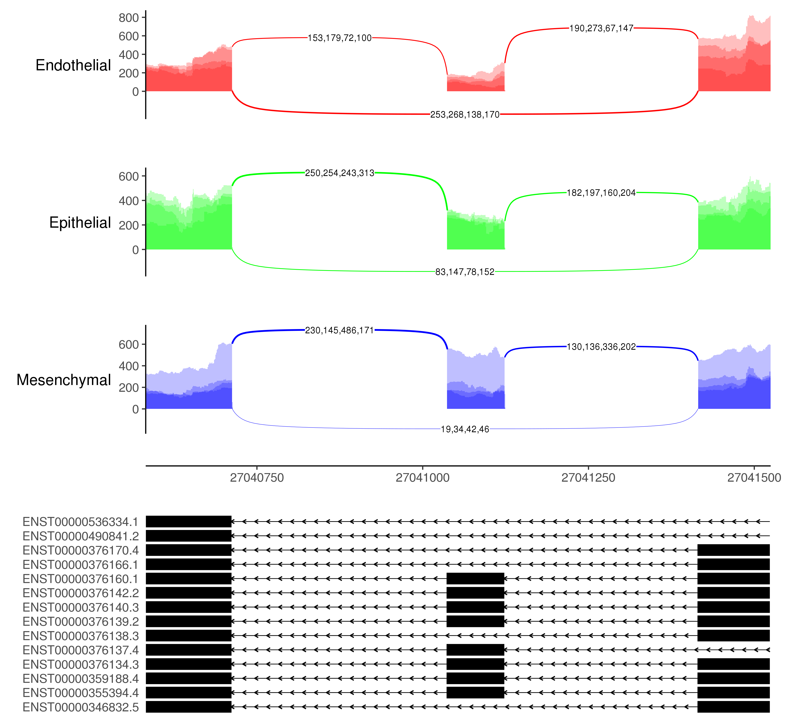

# ggsashimi

[](https://github.com/guigolab/ggsashimi/actions)

Command-line tool for the visualization of splicing events across multiple samples

**[Installation](#installation)**<br>
&ensp; **[Dependencies](#dependencies)**<br>
&ensp; **[Download docker image](#download-docker-image)**<br>
&ensp; **[Build docker image](#build-docker-image)**<br>
&ensp; **[Use docker image](#use-docker-image)**<br>
**[Usage](#usage)**<br>
**[Galaxy](#galaxy)**<br>
**[Cite ggsashimi](#cite-ggsashimi)**



## Installation<a name="installation"></a>

The `ggsashimi` script can be directly downloaded from this repository:

```shell
wget https://raw.githubusercontent.com/guigolab/ggsashimi/master/sashimi-plot.py
```

Change the execution permissions:

```shell
chmod u+x sashimi-plot.py
```

Provided all dependencies are already installed (see below), you can directly execute the script:

```shell
./sashimi-plot.py --help
```

To download the entire repository, which includes the dockerfile and example files:

```shell
git clone https://github.com/guigolab/ggsashimi.git
```

### Dependencies<a name="dependencies"></a>

In order to run `ggsashimi` the following software components and packages are required:

- python (2.7 or 3)
- pysam (>=0.10.0)
- R (>=3.3)
  - ggplot2 (>=2.2.1)
  - data.table (>=1.10.4)
  - gridExtra (>=2.2.1)

Additional required R packages `grid` and `gtable` should be automatically installed when installing R and `ggplot2`, respectively. Package `svglite` (>=1.2.1) is also required when generating output images in SVG format.

To avoid dependencies issues, the script is also available through a docker image.

### Download docker image <a name="download-docker-image"></a>

A public `ggsashimi` Docker image is available in the [Docker Hub](https://hub.docker.com/r/guigolab/ggsashimi/) and can be downloaded as follows:

```shell
docker pull guigolab/ggsashimi
```

__Alternatively__, we provide the Dockerfile if you want to build your local docker image, although most users will not need it.

### Build docker image (optional) <a name="build-docker-image"></a>

After downloading the repository, move inside the repository folder:

```shell
cd ggsashimi
```

To build the docker image run the following command:

```shell
docker build -f docker/Dockerfile -t guigolab/ggsashimi .
```

This can take several minutes.

### Use docker image <a name="use-docker-image"></a>

Once the image is downloaded or built, to execute ggsashimi with docker:

```shell
docker run guigolab/ggsashimi --help
```

Because the image is used in a docker container which has its own file system, to use the program with local files, a host data volume needs to be mounted.

As an example, you can run this command from the main repository folder:

```shell
docker run -w $PWD -v $PWD:$PWD guigolab/ggsashimi -b examples/input_bams.tsv -c chr10:27040584-27048100
```

The '-w' option sets the working directory inside the container to the current directory.
The '-v' option mounts the current working directory and all child folders inside the container to the same path (host_path:container_path).

If your files are in another folder, for example the annotation file is stored in a different folder then the one containing the bam file, you can mount extra folders like this:

```shell
f="$DIR/annotation.gtf"
docker run -w $PWD -v $PWD:$PWD -v $DIR:$DIR guigolab/ggsashimi -b examples/input_bams.tsv -c chr10:27040584-27048100 -g $f
```

You can even mount a single file:

```shell
docker run -w $PWD -v $PWD:$PWD -v $f:$f guigolab/ggsashimi -b examples/input_bams.tsv -c chr10:27040584-27048100 -g $f
```

## Usage <a name="usage"></a>

Execute the script with `--help` option for a complete list of options.
Sample data and usage examples can be found at `examples`

### Debug mode

Debug mode allows to run `ggsashimi` without producing any graphical output. It creates an `Rscript` file in the current working folder, containing all the R commands to generate the plot. It can be useful when reporting bugs or trying to debug the program behavior. Debug mode can be enabled by setting the environment variable `GGSASHIMI_DEBUG` when running the script, e.g.:

```
# export the environment variable
$ export GGSASHIMI_DEBUG=yes
$ sashimi-plot.py -b ...
```

or

```
# set the environment variable inline
$ GGSASHIMI_DEBUG=yes sashimi-plot.py -b ...
```

## Galaxy <a name="galaxy"></a>

Thanks to [ARTbio](https://github.com/ARTbio), now a [Galaxy](https://galaxyproject.org) wrapper for `ggsashimi` is available at the [Galaxy ToolShed](https://toolshed.g2.bx.psu.edu/repository?repository_id=397283a49b821a79&changeset_revision=64aa67b5099f).

## Cite ggsashimi <a name="cite-ggsashimi"></a>

If you find `ggsashimi` useful in your research please cite the related publication:

[Garrido-Martín, D., Palumbo, E., Guigó, R., & Breschi, A. (2018). ggsashimi: Sashimi plot revised for browser-and annotation-independent splicing visualization. _PLoS computational biology, 14_(8), e1006360.](https://doi.org/10.1371/journal.pcbi.1006360)
